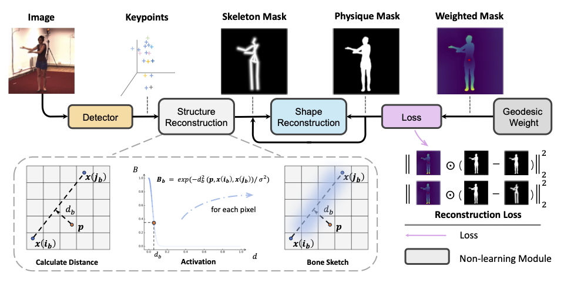

# Mask as Supervision

### 📖 Mask as Supervision: Leveraging Unified Mask Information for Unsupervised 3D Pose Estimation

####  <p align="center"> [Yuchen Yang](https://charrrrrlie.github.io/), [Yu Qiao](https://scholar.google.com/citations?user=gFtI-8QAAAAJ&hl=en), [Xiao Sun†](https://jimmysuen.github.io/)</p>

#### <p align="center">[arXiv](https://arxiv.org/abs/2312.07051)</p>



## TODOs
🔨 Code will be released after the paper is accepted.


## Citation
```
@misc{yang2023mask,
      title={Mask as Supervision: Leveraging Unified Mask Information for Unsupervised 3D Pose Estimation}, 
      author={Yuchen Yang and Yu Qiao and Xiao Sun},
      year={2023},
      eprint={2312.07051},
      archivePrefix={arXiv},
      primaryClass={cs.CV}
}
